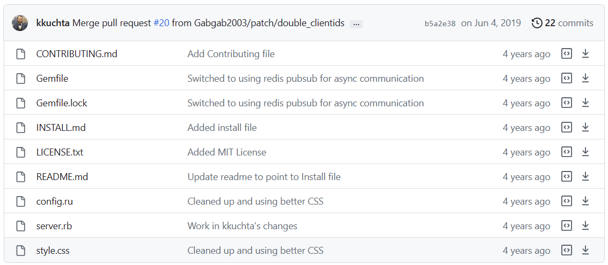

# [开源演示][001期]只用CSS能实现聊天室？
### 一、简介
- 闲来无事，刷刷Github，这样一句话一下吸引到了我。
- “一个真正可怕的异步web聊天，前端不使用任何JS。”  
- 看看效果图
- 
- 看效果还挺不错的，好像真的能聊天！
- 虽然这好像并没有什么意义...但最使我好奇的几个点是：没有js，那么这个聊天室是怎么实现的呢？消息如何传递？为啥不让键盘直接输入文字呢？(神秘度=3;)
  
### 二、浅看
- 打开源码浅浅预览一下
- 
- 可以看到目录结构十分简短，并且没有任何html类型文件和js类型文件，项目主体语言是Ruby，并且使用了Redis作为数据库。
- 那么我们现在可以猜测：逻辑是写在Ruby里面的、聊天信息是通过Redis传递的。(神秘度--;)
- 具体怎么搞，一会再揭晓。

### 三、本地复现
- 根据README.md的提示，我们首先需要准备好Ruby和Redis环境。（环境安装这里就不多赘述了，大概就是下载安装包或者绿色版压缩包之后安装到本地、配置环境变量、运行环境，当然可以使用虚拟机或Docker进行安装）
- 我是在Windows上进行复现的，所以需要下载RubyInstaller和Redis-x64-5.0.14.1.zip。
- 安装好之后，启动完环境。我们的目光就转向了源码，Ruby的包管理工具叫做Gem(可能很多同学不了解Ruby所以在这里说明一下)，在源码目录中有一个叫做Gemfile的文件，这个文件就是用来管理项目所需要的Gem包的。在Gemfile文件中我们可以看见项目依赖于Rack、Puma、Redis、Faker等包，你可能对他们不熟悉，但不要紧，这些和原理无关，我们只需要知道这些包是用来干什么的就行了。Rack和Puma能够实现http服务、Redis是数据库、Faker是用来生成假数据的。我们直接控制台cd到项目目录，然后我们上来就是一条指令：`bundle install`，这条指令会根据Gemfile文件中的内容自动安装所需要的包(网速你懂的，如果批量安装指令一直失败可以使用gem install xxx的指令逐个安装)，安装完之后我们就可以运行项目了。
- 最后执行`bundle exec puma`使用Puma启动项目，然后打开浏览器访问`http://localhost:9292`，就可以看到效果了。
- 
- 演示视频：https://www.bilibili.com/video/BV17e4y1T7gM/

### 四、原理解析
- 
